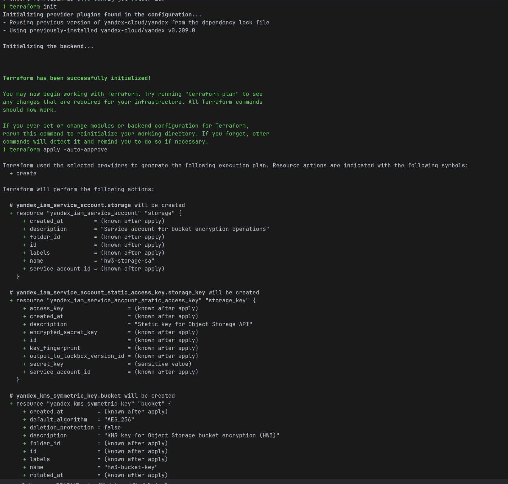
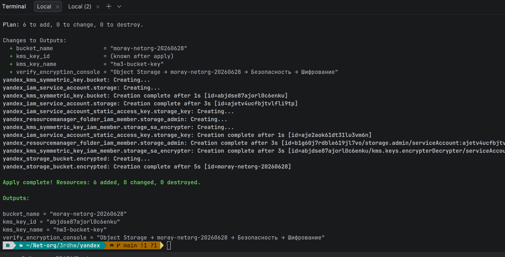
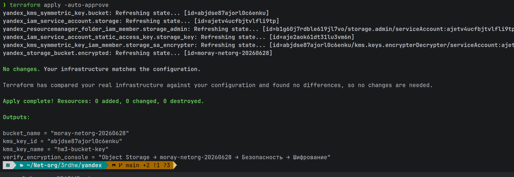
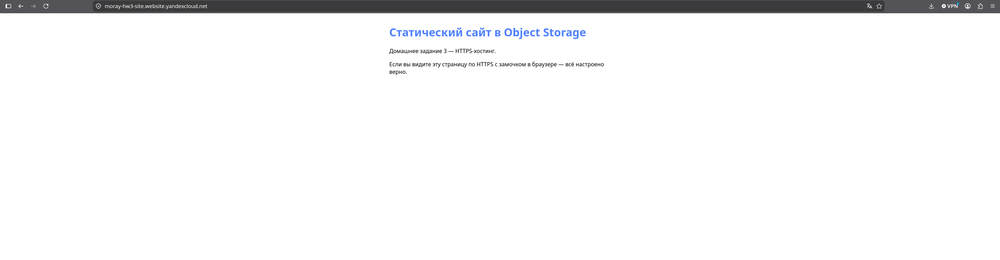
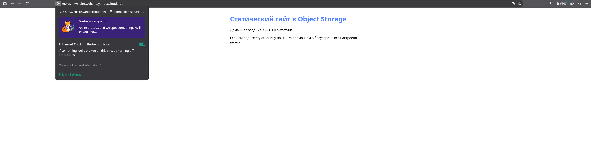

# Домашнее задание 3: KMS и HTTPS-хостинг в Object Storage

Продолжение инфраструктуры из [2ndhw](../2ndhw/README.md).

## Что нужно сделать

| Часть | Способ | Где в репозитории |
|-------|--------|-------------------|
| KMS-ключ + шифрование бакета | **Terraform** | [yandex/](yandex/) |
| Статический сайт + HTTPS | **Вручную** (консоль) | [website/index.html](website/index.html) |

---

## Часть 1. KMS — шифрование бакета (Terraform)

Шифруем бакет из ДЗ 2: `moray-netorg-20260628`.

### Предварительно

Бакет должен существовать (развёрнут [2ndhw](../2ndhw/yandex/)).

### Шаг 1. Убрать бакет из state 2ndhw (чтобы не было конфликта)

```bash
cd ~/Net-org/2ndhw/yandex
terraform state rm yandex_storage_bucket.images
terraform state rm yandex_storage_object.picture   # объект останется в облаке
```

### Шаг 2. Import бакета в 3rdhw

```bash
cd ~/Net-org/3rdhw/yandex
cp terraform.tfvars.example terraform.tfvars   # если ещё нет

export YC_TOKEN=$(yc iam create-token)
export YC_CLOUD_ID=$(yc config get cloud-id)
export YC_FOLDER_ID=$(yc config get folder-id)

terraform init
terraform import yandex_storage_bucket.encrypted moray-netorg-20260628
```

### Шаг 3. Apply

```bash
terraform plan
terraform apply -auto-approve
```
  


Создастся:
- `yandex_kms_symmetric_key` — ключ `hw3-bucket-key`
- шифрование бакета через `server_side_encryption_configuration`

### Проверка

```bash
terraform output
```

Консоль → **Object Storage** → `moray-netorg-20260628` → **Безопасность** → **Шифрование** — должен быть указан KMS-ключ.

---

## Часть 2. Статический сайт + HTTPS (вручную)

> По заданию эта часть **не в Terraform**.

### Вариант А — без своего домена (проще)

Имя бакета **без точек** — HTTPS работает с сертификатом Yandex Cloud автоматически.

#### 1. Создайте бакет для сайта

Консоль → **Object Storage** → **Создать бакет**:

| Параметр | Значение |
|----------|----------|
| Имя | `moray-hw3-site` (без точек, уникальное) |
| Доступ | Публичный на чтение объектов |

#### 2. Включите хостинг сайта

Бакет → **Настройки** → **Веб-сайт**:
- **Главная страница:** `index.html`
- **Страница ошибки:** `error.html` (опционально)

#### 3. Загрузите страницу

Загрузите файл [website/index.html](website/index.html) как `index.html` в корень бакета.

CLI:

```bash
yc storage s3api put-object \
  --bucket moray-hw3-site \
  --key index.html \
  --body ~/Net-org/3rdhw/website/index.html \
  --content-type text/html
```

#### 4. Публичный доступ

Бакет → **Безопасность** → **Политика доступа** / **ACL** — разрешить чтение объектов для всех (или `anonymous_access_flags: read`).

#### 5. Откройте по HTTPS

```
https://moray-hw3-site.website.yandexcloud.net
```

или

```
https://moray-hw3-site.storage.yandexcloud.net/index.html
```

В браузере должен быть **замочек** 🔒.



---
## Удаление ресурсов

```bash
cd ~/Net-org/3rdhw/yandex
terraform destroy   # снимет шифрование и удалит KMS-ключ (осторожно!)
```

Статический бакет сайта удалите вручную в консоли.

## Полезные ссылки

- [Шифрование бакета](https://yandex.cloud/ru/docs/storage/operations/buckets/encrypt)
- [HTTPS для хостинга](https://yandex.cloud/ru/docs/storage/operations/hosting/certificate)
- [Certificate Manager](https://yandex.cloud/ru/docs/certificate-manager/quickstart/)

## Автор

M.Parfentyev
